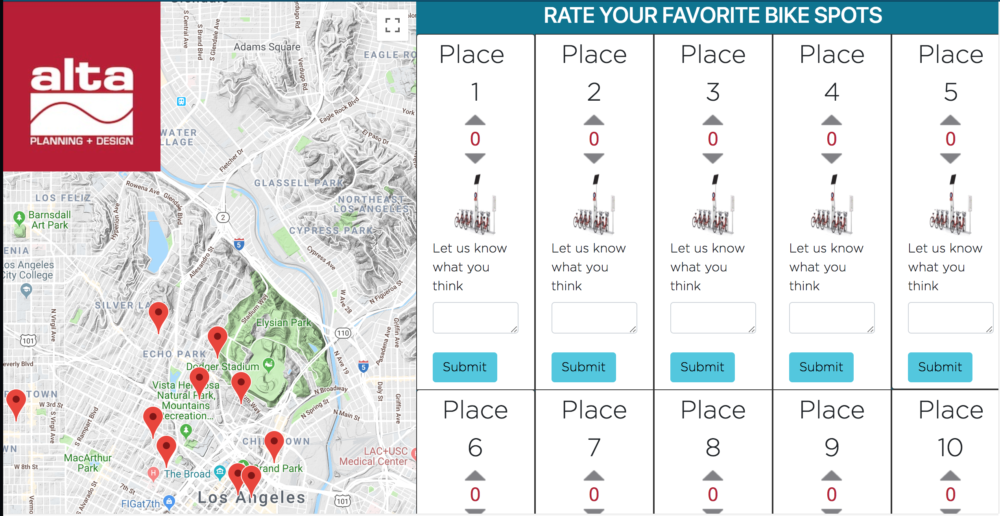

# Alta Code Test

For a future version,

I would include names in the geojson, intersection, or address, so that I could list the locations with more descriptive text than just places 1-9.
I would have the submit button post the comments to the backend
Also with a backend, I could aggregate up/down votes from other users to both show the user the total amount and to send to the city the final ranking.
I would have the pictures be specific for each location. Maybe using google street view.
I would have the markers interact with the list. So by clicking on either the list item or on the marker, it would highlight it’s corresponding spot.

